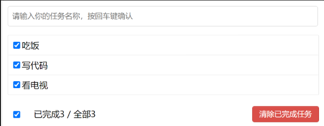

# TodoList项目设计
  
### 1- 数据设计
    1. todoList: 数组；[todoObj, todoObj, todoObj]
    2. todoObj: 对象；{id: string, title: string, done: boolean, isEdit: boolean}
        2.1 id：item的唯一标识；
        2.2 title：渲染的任务名；
        2.3 done完成状态；
        2.4 isEdit：当前item是否处于编辑状态；
## 一、主组件设计
### 1- 主要功能
    1. 保存基础todolist数据；
    2. 向子组件传递todoList；
    3. 接收子组件事件，对todoList进行增删改查；
        3.1 来自input的add事件；
        3.2 来自List的changeStatus事件；
        3.2 来自List的editItem事件；
        3.3 来自List的deleteItem事件；
        3.4 来自footer的changeAllStatus事件；
        3.5 来自footer的clear事件；
## 二、头部组件设计
### 1- 主要功能
    1. 支持输入任务名称
    2. 按回车确认并触发add事件；
    3. add同时，清空input框；
## 三、List组件设计
### 1- 主要功能
    1. 渲染checkbox框、title、修改按钮、删除按钮；
    2. checkbox框点击，触发changeDone事件，修改item的done状态；
    3. 修改按钮
        3.1 点击修改，checkbox及title隐藏，input框展示，修改按钮隐藏；
        3.2 input框触发blur事件，标志修改结束，checkbox、title展示，修改按钮展示，input框隐藏；
    4. 删除按钮
        4.1 点击删除，触发delete事件，删除
## 四、底部组件设计
### 1- 主要功能
    1. 渲染checkbox，完成数，总数，清除按钮；
    2. 点击checkbox，触发changeAllStatus事件，修改所有item的done状态；
    3. 完成数：绑定所有已完成的item数量；
    4. 总数：绑定todoList的length；
    5. 清除已完成按钮：点击触发clear事件，清除todoList中done为true的项；