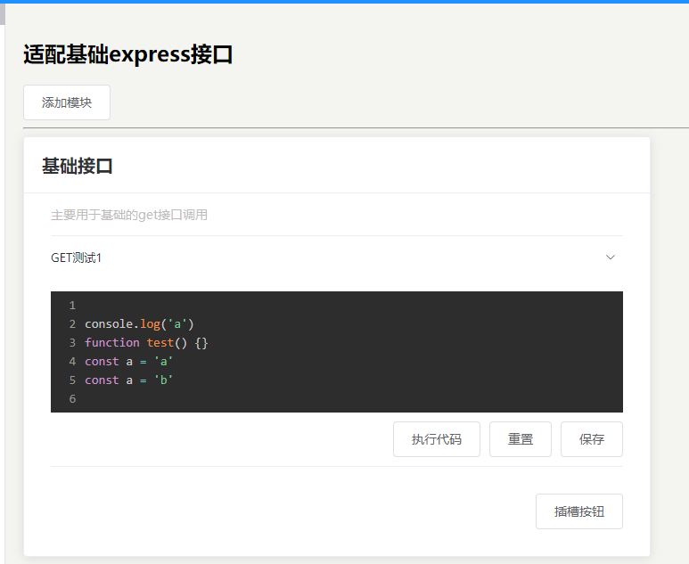

《文章发布组件开发规划》

1. 新增文章：1.支持添加默认文章、2.支持添加自定义文章；
2. 修改并保存文章：1.支持点击按钮保存、2.支持ctrl+s保存、3.支持修改的内容包含：标题、简介、小标题、代码段；
3. 删除目标文章；
4. 执行代码；
5. 重置代码；

具体实现分析：
【2.3 支持修改标题】
期望效果：
    一、大组件：
    1. ArticleCard组件，接收一个数组，遍历该数组，数组每一项，均可渲染为一个独立的“文章”项展示；
    2. “文章”项中，包含了可编辑的“标题”、“简介”、“小标题”、“代码段”；
    3. 其中，“标题”、“简介”、“小标题”展示效果如下（以“标题”为例）：
        3.1 默认情况下，标题渲染为<h2>、
、等标签，仅支持展示;
        3.2 当点击“标题”时，原来的<h2>标签，变成<el-input>标签，且为focus状态；
        3.3 当点击除“标题”<el-input>外任意处，<el-input>标签，变为原来的<h2>标签；
    4. 技术分析：
        4.1 [渲染切换问题] 默认为<h2>标签，点击切换为<el-input>标签；再点击<el-input>标签之外的地方，切换为<h2>标签：
            1. <component :is="comName" @click @blur>可以通过“click”事件和“blur”事件，来控制“comName”；
              【问题1】：一个“文章”项里，有三个地方都需要用到<component>组件，每个<component>组件，如何区别？
              【问题2】：一个ArticleCard组件中，有多个“文章”项，这个每个“文章”项，如何区别？
              【问题3】：重点是，如何设计数据格式，可以解决多个重复组件的问题，防止出现这种情况：
                        切换第一个ArticleCard组件中的“标题”时，其他ArticleCard组件中的“标题”都切换了；
        4.2 [input无法focus问题] 第一次切换为<el-input>组件的时候，可以focus，但是再次切换，就无法focus了：
              【问题1】：再次切换的时候，由于通过<component>组件来实现，click事件监听的时候，是<h2>标签，无法作用到<el-input>标签上;
              【问题2】：